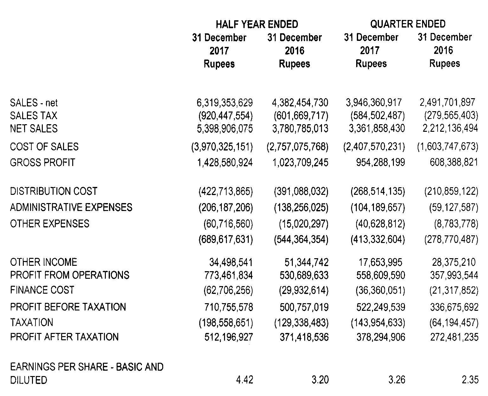
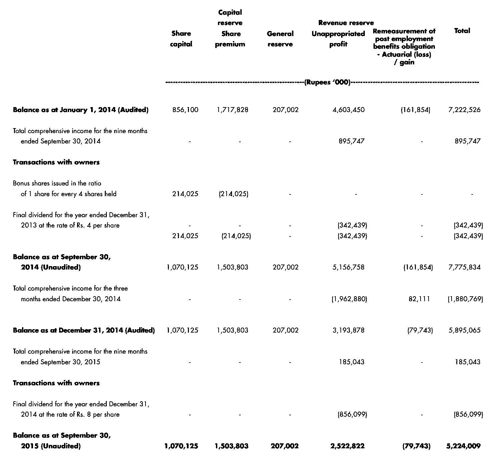
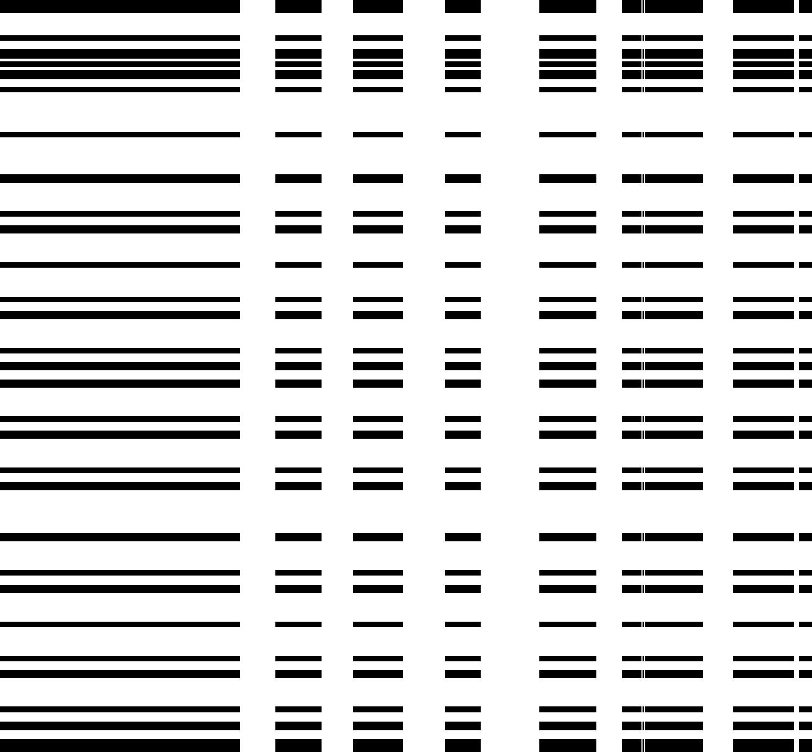

# Deep Splitting and Merging for Table Structure Decomposition

## Data Labelling
Install the [T-Truth ](https://github.com/sohaib023/T-Truth "T-Truth ")labelling tool for labelling the rows and columns of tables in document images.
|  | 
|:--:| 
| *Image labelled using T-Truth tool.* |

## Usage

#### Data Preprocessing
The row and column separator generated by T-Truth tool are few pixel wide. For training the split model we need to maximize the width of row column separators without intersecting any table cell content.
For preprocessing the labelled data:
```
python deep-splitting-merging/preprocess.py -i <PATH_TO_INPUT_IMAGES> -x <PATH_TO_INPUT_XML_LABELS> -p <PATH_TO_OUTPUT_IMAGES> -j <PATH_TO_OUTPUT_JSON_LABELS>
```
#### Training
```
python deep-splitting-merging/main.py -t -i <PATH_TO_INPUT_IMAGES_DIRECTORY> -l <PATH_TO_INPUT_LABELS_DIRECTORY> -o <PATH_TO_OUTPUT_DIRECTORY>
```

#### Testing 
```
python deep-splitting-merging/main.py -e -i <PATH_TO_INPUT_IMAGES_DIRECTORY> -l <PATH_TO_INPUT_LABELS_DIRECTORY> -o <PATH_TO_OUTPUT_DIRECTORY> -c <PATH_TO_CHECKPOINTS_FILE>
```

#### Inference
```
python deep-splitting-merging/inference.py -i <PATH_TO_INPUT_IMAGE> -c <PATH_TO_CHECKPINTS_FILE> -o <PATH_TO_OUTPUT_DIRECTORY>
```

## Table Segmentation Results
<!--   -->
Imput Image                |  Segmented Image
:-------------------------:|:-------------------------:
   |  
   |  

## Citation
If you find this work useful and use this implementation in your research projects, cite the following paper:
```bibtex
@InProceedings{ICDAR2019,
author = {Christopher Tensmeyer, Vlad Morariu, Brian Price, Scott Cohen and Tony Martinez},
title = {Deep Splitting and Merging for Table Structure Decomposition},
booktitle = {The 15th IAPR International Conference on Document Analysis and Recognition (ICDAR)},
month = {September},
year = {2019}
}
```
